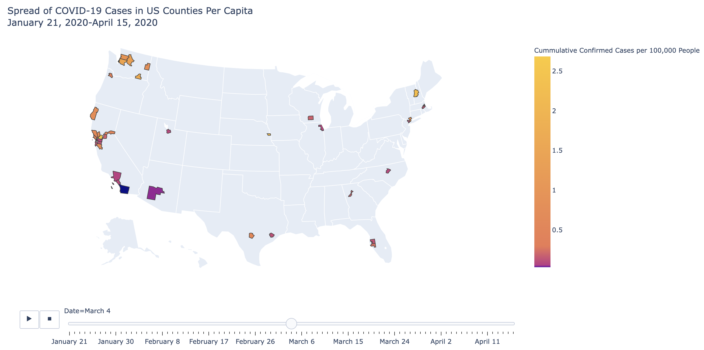
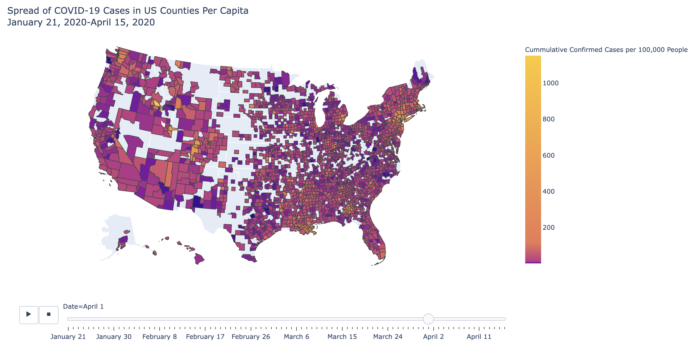

# Analyzing COVID-19 Related Tweets

So far we've focused on Python numerical analyses to gain insights into how the COVID-19 virus might negatively impact certain US counties and how the pandemic has spread  across the US. This is largely because the analyses that we conduct and statistical models that we build depend on numbers, however, much of the world around us operates in non-numerical language. It's useful for organizations to analyze textual data so that they can better understand consumers' opinions and feedback, trending topics, or common reactions to an event. Social media websites, such as Twitter, also provide large amounts of individualized, textual data that can help us derive valuable insights from different communities or on different topics and check the pulse of different events, topics, or points in time. While we need to comply with the terms and user agreements in each social media \(or any website\) platform, we can use most of this data for our own analysis once we format this in a usable structure. 

### Natural Language Processing in Python

While sentences, paragraphs, and documents have some structural element, it's difficult to perform analyses on textual data since there's not necessarily a standard "data frame" of information for all letters and words. We'll use the [Natural Language Toolkit](https://www.nltk.org/) \(NLTK\) Python package to help us structure and analyze sentences, phrases, and words in a dataset of tweets that reference COVID-19 \(or a related term\) as a hashtag to see how people are talking about COVID-19 and what else they might be talking about at the same time. Looking at this information over several days might give us insight into how people's reactions change over time or how different events impact the kind of language people use in their tweets. 

Although the first COVID-19 in the US was reported in late January 2020, we saw in our [animated geospatial county map](https://github.com/jhu-business-analytics/covid-19-map-visualizations) that the number of COVID-19 cases in the US spread slowly throughout February 2020, and then quickly between March 4, 2020:



and April 1, 2020 \(4 weeks later\):



**We'll analyze** [**COVID-19-related tweets**](https://github.com/echen102/COVID-19-TweetIDs) **scraped and formatted by a group at the** [**University of Southern California's Information Sciences Institute**](https://arxiv.org/pdf/2003.07372.pdf) **to see how people's tweet language differed on these dates.**

## Business Question
How have people's opinons or feelings changed about COVID-19 in the month between March 4, 2020--when there were relatively few cases and deaths in the United States--and April 1, 2020--when the United States had declared a State of Emergency for COVID-19 and most states had implemented stay-at-home orders?

## Data Question
Which data and metrics can help us answer our question? We'll use public Tweet data to estimate English conversations related to COVID-19, and use word clouds to visualize the change in language between March 4th and April 1st. 

We'll use Twitter ID data collected by a group at the [USC Information Sciences Institute](https://github.com/echen102/COVID-19-TweetIDs), which we hydrate with [Hydrator](https://github.com/DocNow/hydrator)

In our Python Notebook environments, we'll use the following packages: 
```
pandas 1.0.3
numpy 1.18.1
nltk 3.4.5
wordcloud 1.6.0
pillow 7.0.0
matplotlib 3.1.3

```
## Data Answer
The steps for our analysis are available in [this GitBook tutorial](https://melanieshimano.gitbook.io/twitter-text-analysis-with-python/), and you can use [this pre-commented starter notebook to follow along with the tutorial, or copy and paste the code from the codeblocks (dark blue text boxes) in the tutorial to create these and other word cloud data visualizations:


## Business Answer
How does the Tweet language differ between March 4, 2020 and April 1, 2020, and what does this tell us about how people might think about the pandemic, what they might be concerned about, or what the state of the world is like? Since so much new information about COVID-19 is released every day, what other date ranges might be better to compare? How might organizations use this Twitter information in their daily operations or in communication with their employees or customers?


