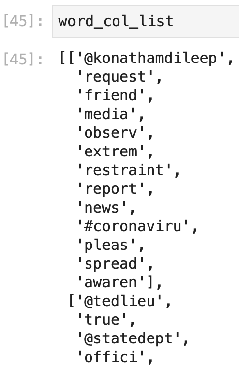
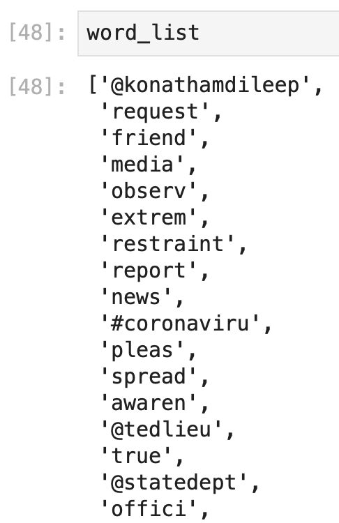
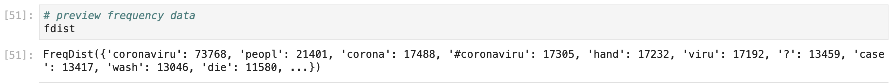
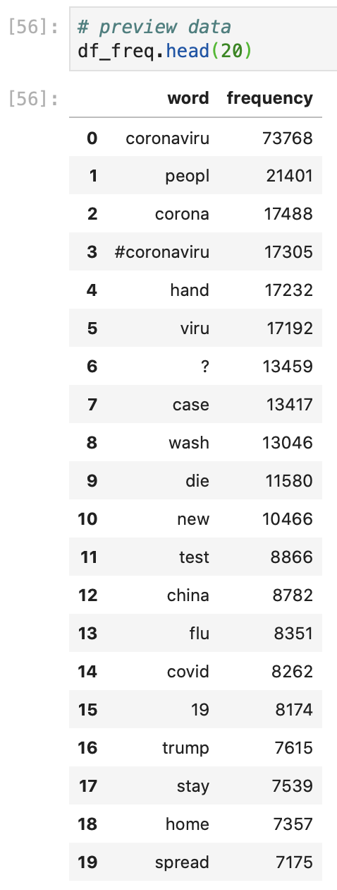

# Analyzing Word Frequency

### Format Text into a List

Now that we have a cleaned text data frame, we can analyze the frequency of different words in our data frame of Tweets. We'll use the FreqDist \(frequency distribution\) library  to analyze the frequency of words in the tweets, but first, we need to combine the column of lists of words into one, giant list:

```python
# create a list of all of the tokenized, non stopword words
word_col_list = df_march4_filter["no_symbols"].tolist()
```

Here, we define a list \(`word_col_list =` \) as the values in the no\_symbols column \(`df_march4_filter["no_symbols"]`\) as a list \(`.tolist()`\), which looks like: 



Which is almost what we want. Notice that there are square brackets surrounding the entire list, and the items that were in each data frame row \(essentially a list of lists\). We want to create one single list, so to "flatten" it we write statements to "loop" through each sublist and each word. This is the expanded version of how we wrote some of the list comprehension statements earlier:

```python
# make emptly list
word_list = []

# flatten the list
#for every sublist (column row) in our total list
for sublist in word_col_list:
    # and for every word in the sublist
    for word in sublist:
    # add the word in the sublist to our new word_list
        word_list.append(word)
```

Here we first create the name of a list where we'll store all of the values that we want in our list \(`word_list = []`\). Then, we'll add in \(`.append()`\) every word  \(`word`\) in every sublist in our list of lists to our empty list \(`for word in sublist` + `for sublist in word_col_list`\) , which essentially "recreates" the list of lists as a single list. 

This gives us a long list of all of the stemmed, non-stop word, non-symbol, tokenized Tweet text: 



### Calculate the Frequency of Words

We can now use the FreqDist library to quickly calculate the frequency of words in our Tweet text:

```python
# look at the frequency of each word to see what people were talking most about in this hour
# get frequency of words
fdist = FreqDist(word_list)
```

Here, we define a new element \(`fdist =`\) that uses the frequency distribution function \(`FreqDist`\) on our long list of Twitter text \(`word_list`\). This creates a dictionary that return the word \(or root word\) and the number of times it appears in our list, with looks like: 



This format in Python is called a **dictionary.** These are essentially _key:value_ pairs that we can use to store and recall data. The _keys_ in dictionaries are unique, which can make using dictionaries more useful than dataframes in some instances. For our purposes, we want to visualize and continue to analyze these values in a dataframe, so we can turn this into a more useful dataframe format with: 

```python
# turn frequency into a dataframe
df_freq = pd.DataFrame(fdist.items(), columns=['word', 'frequency'])
```

Here we create a new dataframe \(`df_freq=`\) by using pandas to create a dataframe \(`pd.DataFrame()`\) out of the items in our frequency distribution dictionary \(`fdist.items()`\) and we rename the columns to better describe the data in the dataframe \(`columns = ["word", "frequency"]`\). 

We're also curious to see which words show up most frequently, so we'll sort our new dataframe by descending frequency: 

```python
# sort words by most frequent-least frequent
df_freq = df_freq.sort_values(by = "frequency", ascending = False).reset_index()
```

Here we redefine our frequency dataframe \(`df_freq =`\) as our same frequency dataframe \(`df_freq`\) but with the values in the frequency column \(`by="frequency"`\) sorted \(`.sort_values()`\) in a descending order \(`ascending = False`\). We also reset the row values to clean up the dataframe since they maintain the original row numbers when we sort them \(`reset_index()`\). You can build the dataframe without `reset_index()` to see how the dataframe reorganizes without this. 

Resetting the index automatically creates a new column with the original index values, which we can delete: 

```python
# delete index column
del df_freq["index"]
```

To get our frequency dataframe that looks like: 



Which we can use to look at the frequency of words used in COVID-19 Tweets on March 4, 2020 between 16:00-17:00 UTC. This analysis summarizes Twitter data for all of the Tweets in this hour, which gives us insight into what people were talking about related to the novel coronavirus at this time, however, we may also want to conduct further analysis to look at what people were most frequently exposed to. For example, how does the "relevance" of a word change if we take into consideration the number of retweets or likes that a Tweet receives? All of the text might give us insight into what people are willing to post, but engagement metrics can give us better insight into what people think is most important. 

