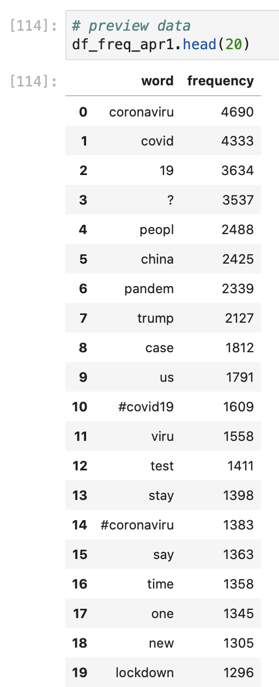
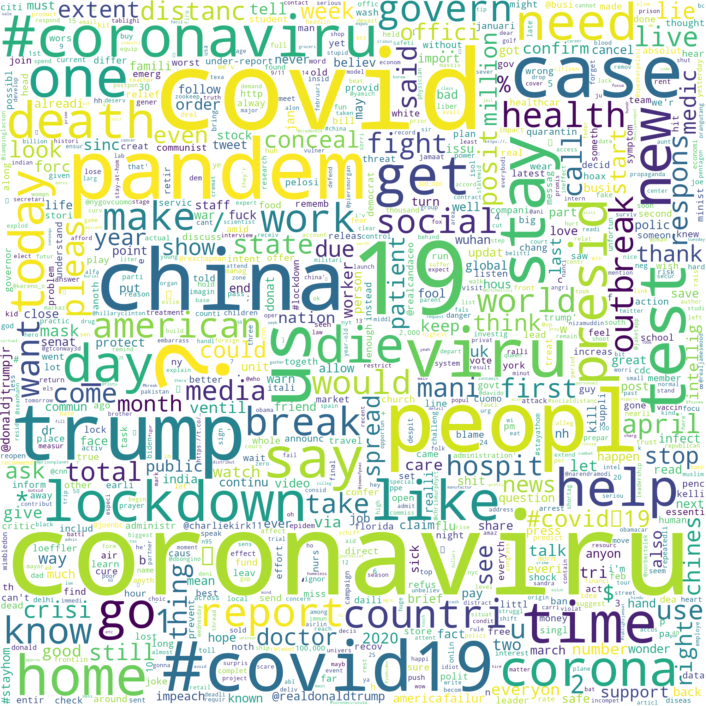

# Comparing COVID-19-Related Tweets from March 4th and April 1st

Since both of the Tweet data sets are formatted in the exact same way, we can use the same code to format and analyze the April 1, 2020 Twitter data set. We won't need to use all of the lines of code, though, since we already defined certain functions and lists \(for example, the `tweet_tokenizer` function and the `stop_words` list that now contains symbols and "rt"\). We can create a dataframe o the April 1st data with the following code: 

```python
# make column of lowercase text
df_en_april1["lcase_text"] = df_en_april1["text"].str.lower()
```

```python
# make new column that tokenizes the tweet text
df_en_april1["tokenized_text"] = df_en_april1["lcase_text"].apply(word_tokenize)
```

```python
# edit dataframe to only include tweet id, tweet text and tokenized text columns
df_april1_filter = df_en_april1.filter(items = ["id","lcase_text", "tokenized_text"]).reset_index()
```

```python
# delete the index column since we don't need this information
del df_april1_filter["index"]
```

```python
# make column of tokenized twitter data
# keeps @mentions together and #hastags together, etc.
df_april1_filter["tweet_tokens"] = df_april1_filter["lcase_text"].apply(tweet_tokenizer.tokenize)
```

```python
# remove stop words from tokenized tweet words
df_april1_filter["no_stopwords"] = df_april1_filter["tweet_tokens"].apply(lambda ttweet:[word for word in ttweet if word not in stop_words])
```

```python
# make new coludf_march4_filterf stemmed words in dataframe
df_april1_filter["stem_words"] = df_april1_filter["no_stopwords"].apply(lambda sublist : [ps.stem(word) for word in sublist])
```

```python
# create a list of all of the tokenized, non stopword words
word_col_list_apr1 = df_april1_filter["stem_words"].tolist()
```

```python
# make emptly list
word_list_apr1 = []

#flatten the list
for sublist in word_col_list_apr1:
    for word in sublist:
        word_list_apr1.append(word)
```

```python
# look at the frequency of each word to see what people were talking most about in this hour
# get frequency of words
fdist_apr1 = FreqDist(word_list_apr1)
```

```python
# turn frequency into a dataframe
df_freq_apr1 = pd.DataFrame(fdist_apr1.items(), columns=['word', 'frequency'])
```

```python
# sort words by most frequent-least frequent
df_freq_apr1 = df_freq_apr1.sort_values(by = "frequency", ascending = False).reset_index()
```

```python
# delete index column
del df_freq_apr1["index"]
```

To get a dataframe of word frequencies from COVID-19-related Tweets on April 1, 2020: 



And we can use the frequency distribution to create a word cloud of word frequencies with: 

```python
# edit wordcloud image
wordcloud_april1freq = WordCloud(max_words=1000,
                             width = 2000,
                             height = 2000,
                             background_color="white").generate_from_frequencies(frequencies = fdist_apr1)
plt.figure()
plt.imshow(wordcloud_april1freq, interpolation="bilinear")
plt.axis("off")
```

And save this file with: 

```python
# save to file
# save word cloud to image
wordcloud_april1freq.to_file("covid19-wordcloud-april1-word-frequency.png")
```

Which gives us: 



We can use both the data frames and the word clouds of word frequencies to look at the difference in people's language when they Tweeted about COVID-19: 


There are several overlapping frequent words, but we can see that the words in the March 4, 2020 Tweets are more distributed than the words in the April 1, 2020 Tweets \(both images contain only 1,000 words\). It seems as if people who are tweeting with a COVID-19-related hashtag have started to Tweet out similar messages or messages relating to similar topics with standard language by April 1st, rather than Tweeting out their individual ideas and thoughts about COVID-19. In between these two dates, WHO declared COVID-19 a pandemic \(March 11\), Trump declared a State of Emergency for COVID-19 \(March 25\), and most US states implemented stay-at-home orders, banned gatherings of more than 10 people, and ordered schools, non-essential retail, and restaurants and bars to close. **What else can we infer from the frequency dataframes and the word clouds from these two dates?**

**Since so much new information about COVID-19 is released every day, we might want to look at changes in Tweet language on a smaller scale. What other date ranges might be better to compare? How might organizations use this Twitter information in their daily operations or in communication with their employees or customers?**

 


