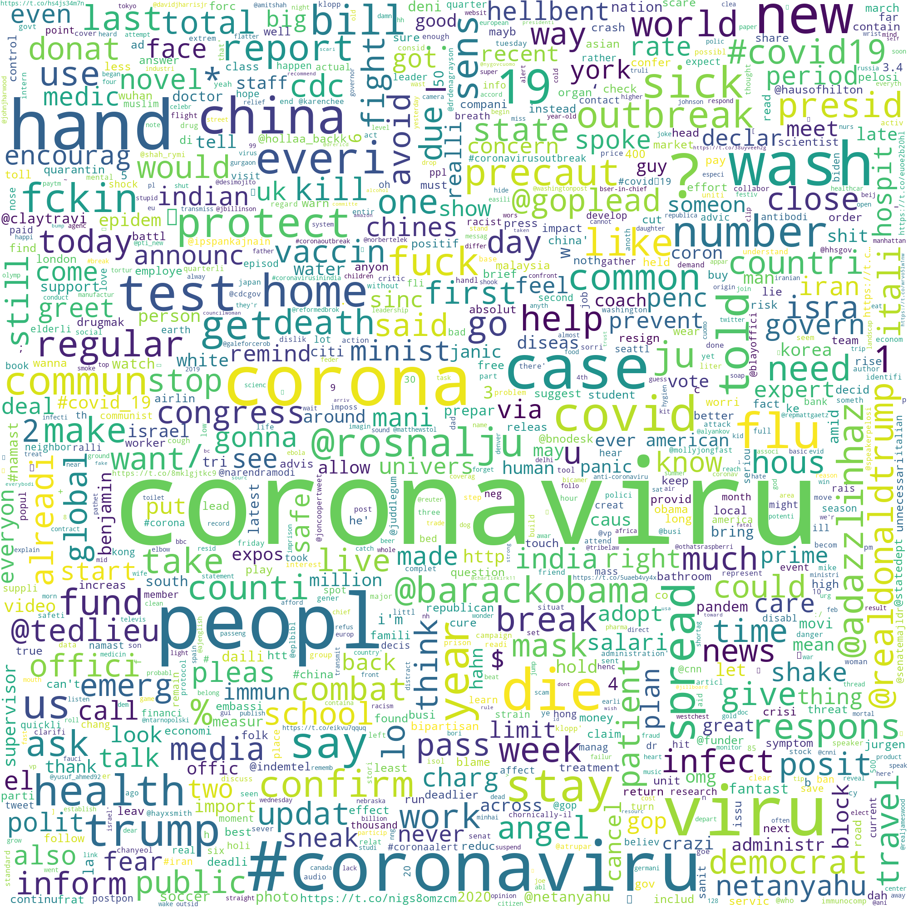

# Generating Frequency Word Cloud Data Visualization

Now we can create a word cloud visualization using the frequency of our edited, tokenized words.

We'll use the same code that we used before, but this time, we'll generate the word cloud from the frequency values of each word, instead of having the word cloud algorithm select the word or phrase combinations for us. Since we've edited and combined stem words, these values may show a higher frequency than they previously showed.

```python
# edit wordcloud image
wordcloud_march4freq = WordCloud(max_words=1000,
                             width = 2000,
                             height = 2000,
                             background_color="white").generate_from_frequencies(frequencies = fdist)
plt.figure()
plt.imshow(wordcloud_march4freq, interpolation="bilinear")
plt.axis("off")
```

Here, everything is the same as our previous word cloud code, except we use the `.generate_from_frequencies()` function instead of the `.generate()` function to generate the word cloud. When we generate the word cloud from frequencies, we need to specify what the frequencies are from a dictionary, so we can use the `fdist` frequency dictionary that we previously created to do this, and identify this using the `frequencies =` parameter. 

This gives us the following word cloud image:



Which looks similar to what we had before, but includes only words and doesn't combine website information. Some of this might be confusing to look at since these are the root words \(e.g. _precaut_ or _emerg_\). We can't necessarily "un-stem" words unless we've kept a dictionary of the original words and stems to map these back to each other, but we could use frequencies of non-stemmed words if we are concerned with the full word showing up on our word cloud visualization. 

