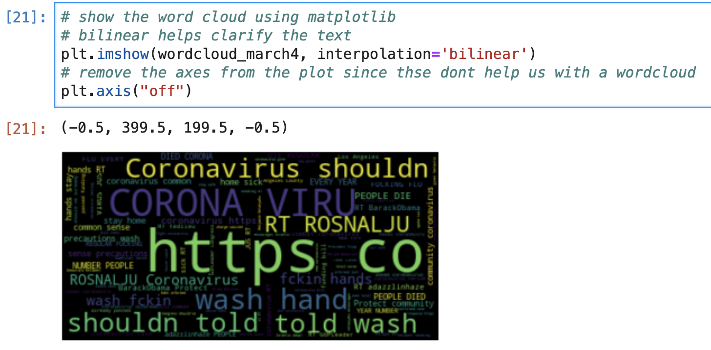
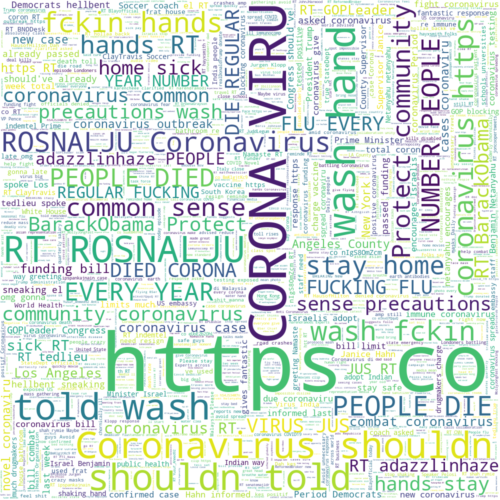
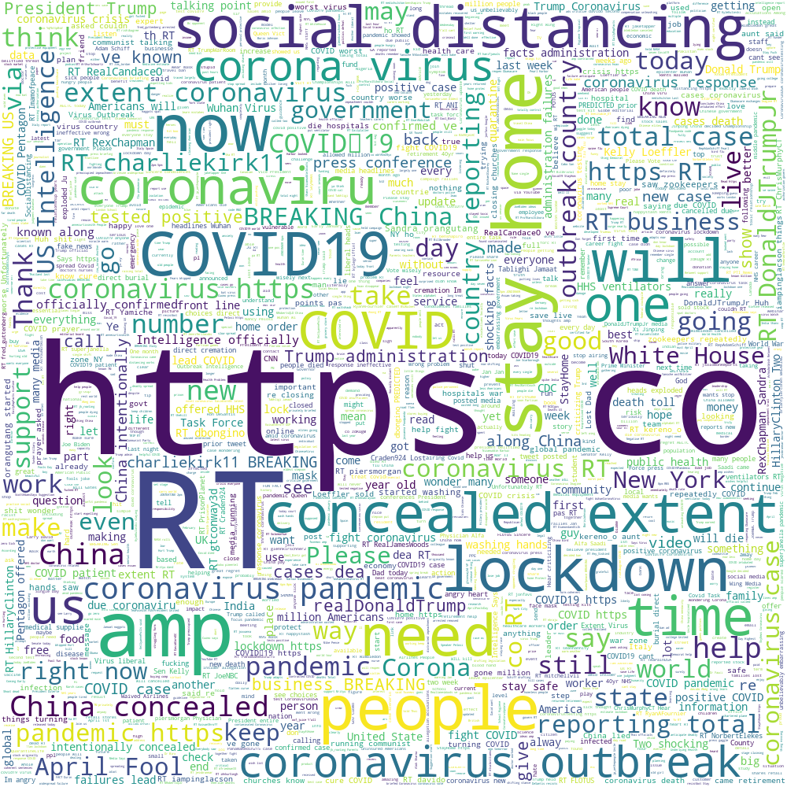

# Creating Word Cloud Visualizations

The `text` column in our data frame contains the hydrated tweets, which we can use to  gain insight into what people are concerned with on March 4, 2020--when COVID-19 was a known but early phase problem--and on April 1, 2020--when COVID-19 cases and deaths had been reported in almost every US county. 

### Creating a Word Cloud Visualization

One way that we can quickly view what people are talking about and how their Twitter posts and conversations differ on different days is to make a word cloud visualization. Word clouds are groups of text that are formatted to emphasize frequency or importance of words or phrases in an artistic fashion. The wordcloud Python package uses an algorithm to display more frequent words or groups of words from a text block in a larger font in our image. To generate a word cloud visualization, all we need to to is make sure that our input data is in a single block of text \(rather than in a data frame\).

We'll start by looking at the data from March 4, 2020. To do this, we'll first turn our column of Tweet text data into a list:

```python
# make march 4 column into a list
march4_list = df_en_march4["text"].tolist()
```

Here we define a new list \(`march4_list =`\) that contains all of the values in the Tweet text column \(`df_en_march4["text"]`\) in a list format \(`.tolist()`\). Each item in a list format is separated by a comma, and the entire list is enclosed in square brackets \(`[ ]`\), so our `march4_list` will have the format: `["text from tweet in first column", "text from tweet in second column", ..., "text from tweet in last column"]`

 Since we need the input data for our word cloud to be in one, continuous block of text \(not in a list\), we'll combine the values in our list into one _string_:

```python
# make one large string from text column to make into a wordcloud
text_march4 = (" ").join(march4_list)
```

Here, we're defining a new string/value that we want to input into our word cloud parameters \(`text_march4 =`\) that contains the data from our list of tweet text data \(`march4_list`\) joined together in the same order \(`.join()`\) with a space separating each element in the original list \(`" "`\).

Now we can use this block of text to [generate the word cloud data](https://amueller.github.io/word_cloud/generated/wordcloud.WordCloud.html) that we'll "plot" in our word cloud: 

```python
# Create and generate a word cloud image:
wordcloud_march4 = WordCloud().generate(text_march4)
```

Then, we can plot our data in a "graph":

```python
# show the word cloud using matplotlib 
# bilinear helps clarify the text
plt.imshow(wordcloud_march4, interpolation='bilinear')
# remove the axes from the plot since thse dont help us with a wordcloud
plt.axis("off")
```

When we generate word cloud images, we're using the Python package `matplotlib` instead of `plotly.express`, which is why we use `.plt` to generate the images instead of `.px`. When using matplotlib, we need to first generate the data for the data visualizations, and then we can plot \(`.imshow`\) this data and edit the image layout. Here, we use matplotlib \(`plt`\) to generate an image for our word cloud \(`.imshow()`\) that contains our word cloud data from March 4, 2020 \(`wordcloud_march4`\). We also format the layout so that the text shows us [smoother](https://matplotlib.org/gallery/images_contours_and_fields/interpolation_methods.html) \(`interpolation = "bilinear"`\), and we remove the axes from the chart \(`.axis("off")`\) since we don't need axes for this type of data visualization.

This generates a word cloud that looks like:



This is nice, but we can reformat some of the word cloud parameters to make this a little easier to read:

```python
# edit wordcloud image
wordcloud_march4 = WordCloud(max_words=5000, 
                             height = 1000,
                             width = 1000,
                             background_color="white").generate(text_march4)
# create a plot
plt.figure()
# add wordcloud data to plot
plt.imshow(wordcloud_march4, interpolation="bilinear")
# remove axes from plot
plt.axis("off")
```

Here, we generate the same image, but we edit a few parameters: 

* **`max_words=5000`**: edit maximum number of words to show in our word cloud so that our visual doesn't look too sparse or overcrowded
* **`height = 1000`** and **`width = 1000`**: edit the size of our visual to increase the resolution in our word cloud
* **`background_color="white"`**: edits the background color to white instead of black so that we can more easily read some of our text

This gives us the following word cloud:



which we can download with: 

```python
# save word cloud to image
wordcloud_march4.to_file("covid19-wordcloud-march4-initial.png")
```

Here we can see that a lot of people are mentioning COVID-19 even outside of their hashtags, but we also have words from people who tweet or who are mentioned a lot in this hour \(@BarackObama and  @ROSNALJU\). The word cloud generator removes filler words like "and", "if" , and "the", but we also see a lot of words like "https" and "co" since a lot of people insert website links in their tweets as well.

We can then do the same analysis with our data from April 1, 2020, to compare the visualizations: 

```python
# make march 4 column into a list
april1_list = df_en_april1["text"].tolist()

# make one large string from text column to make into a wordcloud
text_april1=(" ").join(april1_list)
```

```python
# edit wordcloud image
wordcloud_april1 = WordCloud(max_words=5000, 
                             height = 1000,
                             width = 1000,
                             background_color="white").generate(text_april1)
plt.figure()
plt.imshow(wordcloud_april1, interpolation="bilinear")
plt.axis("off")
```

```python
# save word cloud to image
wordcloud_april1.to_file("covid19-wordcloud-april1-initial.png")
```

Which gives us: 



Here we see a lot more COVID-19 related tweets but less words that include "coronavirus," although we still see "words" such as RT, https, and co, that aren't necessarily relevant for our analysis. 

Next we'll review how to more explicitly analyze the Tweet text and generate more clear word cloud data visualizations. 


