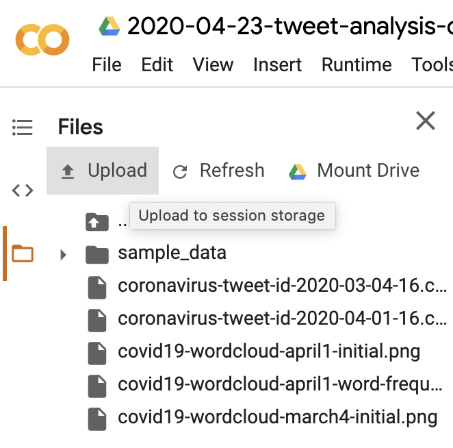
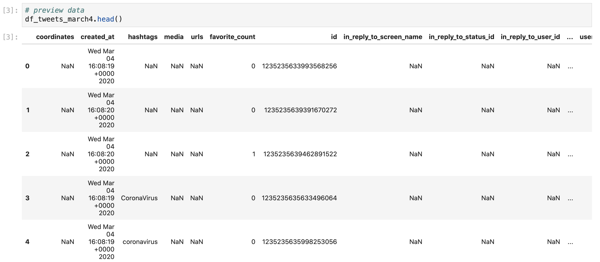
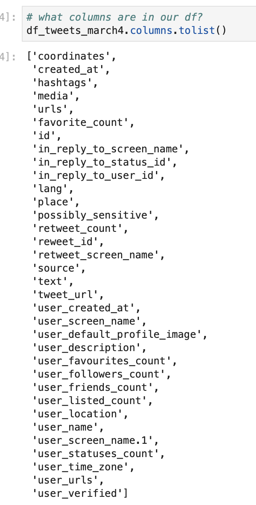

# Installing Packages for Natural Language Processing

Before we open JupyterLab for our analysis, we need to install a couple new packages for our text analysis and visualizations. In your business-analytics Anaconda environment, search for and install the following packages: 

* **nltk**
* **wordcloud**
* **pillow**

After you apply these packages to your environment, launch JupyterLab from Anaconda.

### Importing Packages in JupyterLab

In our JupyterLab notebook, we'll first import the libraries and packages that we'll use for our analysis: 

```python
# import packages for data analysis
import pandas as pd
import numpy as np

# import packages for text analysis/manipulation
import nltk
# separate strings of text into individual words
from nltk.tokenize import sent_tokenize, word_tokenize
from nltk.tokenize import TweetTokenizer
# remove/identify stop words
from nltk.corpus import stopwords
# identify roots of words 
from nltk.stem import PorterStemmer
# get frequency of words
from nltk.probability import FreqDist

# for wordcloud image
from os import path
from PIL import Image
from wordcloud import WordCloud, STOPWORDS, ImageColorGenerator

import matplotlib.pyplot as plt
%matplotlib inline
```

We'll review what all of these libraries do during the analysis, but these are segmented here based on their functionality in our code \(data analysis, text analysis, generating wordcloud images\) to help outline our textual analysis process. 

### Importing Data

We'll import our data in the same way that we've imported data for our other Python data analysis work: 

```python
# import twitter data from march 4 at 16UTC
df_tweets_march4 = pd.read_csv("coronavirus-tweet-id-2020-03-04-16.csv")

# import twitter data from april 1 at 16UTC
df_tweets_april1 = pd.read_csv("coronavirus-tweet-id-2020-04-01-16.csv")
```


If you are using Google Colaboratory, you can upload your files directly to Google Colab and use the same code to import the data. 

Click on the file link on the left menu, then click on the Upload button to upload your hydrated Twitter data sets, shown in the image below




Which gives us data frames that look like this: 



The data frame is too large to show all of the columns, but we can type `df_tweets_march4.columns.tolist()` to get a list of all of the column names so that we know what we can filter and use in our analysis: 



As we can see from the columns, some of our data contains coordinate or place data, which can be useful if we want to restrict our analysis to the United States \(building off of our previous analysis of COVID-19 case spread in US counties\). However, if we look at `df_tweets_march4.info()` we can see that we only have location data for 1,242 out of 176,768 tweets, which significantly cuts down our useable data. Instead, we'll limit our data to English language tweets based on the language column to estimate how people who Tweet in English talk about COVID-19 on different dates. Analyzing only English words will also help us later on when we edit and filter our dataset for common filler words and symbols. 

To edit our dataset to include only English language tweets, we write: 

```python
# make dataframe that only includes english words
df_en_march4 = df_tweets_march4[df_tweets_march4["lang"] == "en"]
df_en_april1 = df_tweets_april1[df_tweets_april1["lang"] == "en"]
```

