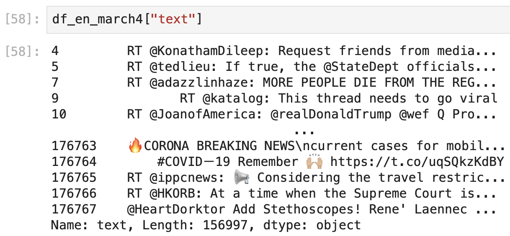
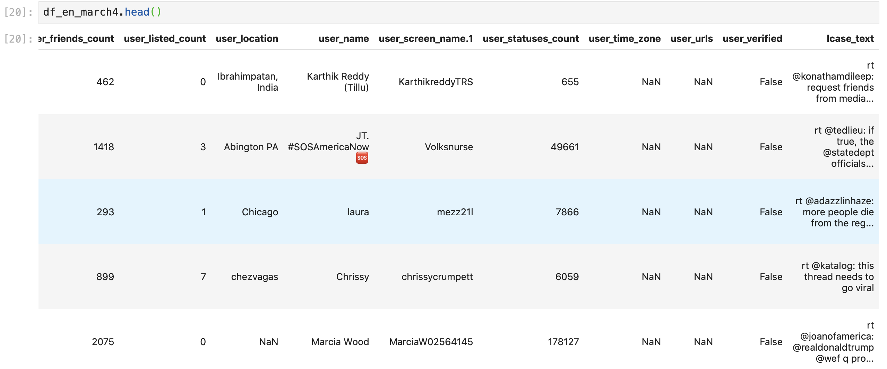
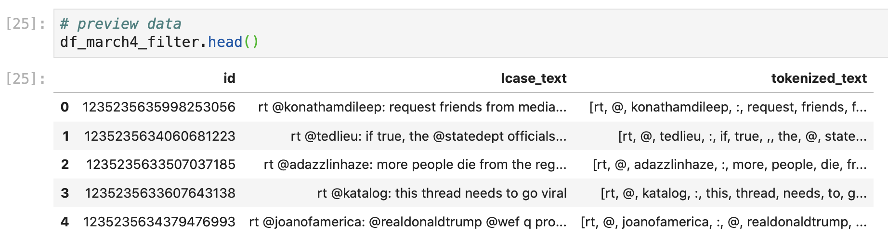
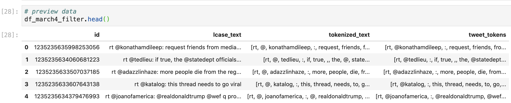
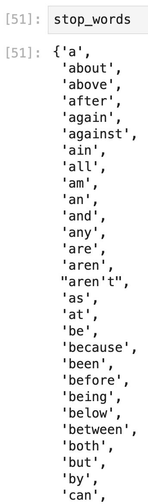
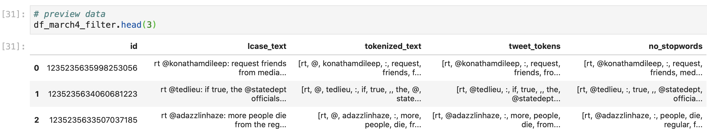
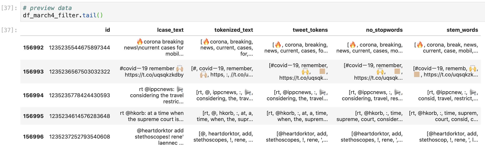
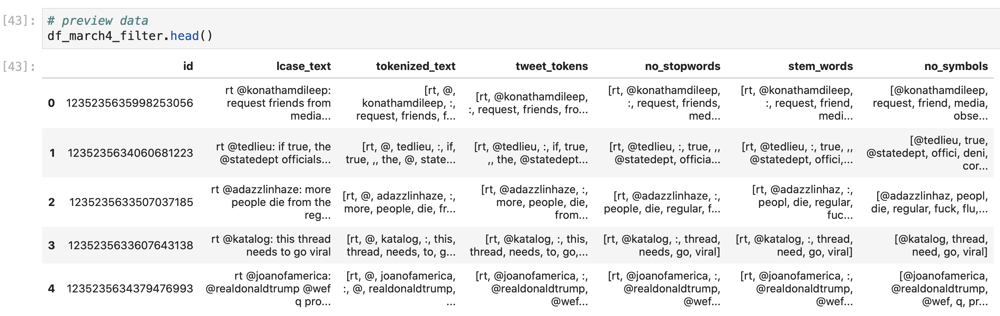

# Manipulating Text Data

While word clouds are great visuals to quickly gain insight into what is mentioned most frequently in our text, these data visualizations only give us contextual relationships with words and phrases, similar to the choropleth maps that we made earlier. Unlike with our plotly express choropleth maps, we can't hover over our text in the word cloud to see how many times the specific word was mentioned or what percentage this word or phrase shows up out of the entire block of text. 

To extract more quantitative data about the Twitter texts, we'll manipulate our Twitter text with the NLTK Python package.

### Lowercase All Tweet Text

If we look at our filtered dataframe, we can see that our Tweet text column has several words, numbers, and symbols that are in both upper and lowercase. 



Since Python only recognizes words as "the same" if they match in letters and case, we'll first make all of the text in our dataframe into lowercase to help standardize some of the word frequency and counting later on: 

```python
# make column of lowercase text
df_en_march4["lcase_text"] = df_en_march4["text"].str.lower()
```

Here, we're defining a new column in our dataframe \(`df_en_march4["lcase_text"] =`\) as the same string values \(`.str`\) in the column with Tweet text \(`df_en_march["text"]`\), but as all lowercase text \(`lower()`\). This gives us: 




### Parse Out Individual Words in Tweets \(Tokenizing\)

To count the frequency of words in our text data segments, we'll first need to **tokenize** our strings of text, which means that we'll need to segment each line of text into lists of individual words. This will help us analyze the frequency of individual words, remove specific unimportant and frequent words, and identify parts of speech in our text.

To do this we write: 

```python
# make new column that tokenizes the tweet text
df_en_march4["tokenized_text"] = df_en_march4["lcase_text"].apply(word_tokenize)
```

Here, we define a new column in our data frame \(`df_en_march4["tokenized_text"] =`\), that contains the values in the Tweet text column in our data frame \(`df_en_march4["lcase_text"]`\) where we've applied \(`.apply()`\) the word\_token function from the ntlk package \(`word_token`\) to tokenize the values in each row of the text column. 

To simplify our dataframe and only look at the Tweet text and our edited values that we will create, we'll also filter our dataframe to only include the Tweet ID \(so that we can match this data back to our original dataframe, if needed\), the Tweet text, and the tokenized Tweet text: 

```python
# edit dataframe to only include tweet id, tweet text and tokenized text columns
df_march4_filter = df_en_march4.filter(items = ["id","lcase_text", "tokenized_text"]).reset_index()
```

And, we'll delete the newly created "index" column, since these are just the  row "header" numbers from our original dataframe, which don't give us any valuable information here:

```python
# delete the index column since we don't need this information
del df_march4_filter["index"]
```

This gives us: 



We see that the `tokenized_text` column has segmented each Tweet into individual words or symbols. This will help us analyze specific words, but we might also want to keep mentions \(@twitter\_handle\) or hashtags \(\#hashtag\_word\) together since we're analyzing Twitter data. To tokenize Twitter specific "words" we'll use the TweetTokenizer library to define a Tweet tokenizer function:

```python
# define the tweet tokenizer function
tweet_tokenizer = TweetTokenizer()
```

and then apply this defined function to the Tweet text column:

```python
# make column of tokenized twitter data
# keeps @mentions together and #hastags together, etc.
df_march4_filter["tweet_tokens"] = df_march4_filter["lcase_text"].apply(tweet_tokenizer.tokenize)
```

Here we also need to add in the `.tokenize` element inside the the `.apply()` parentheses because our defined `tweet_tokenizer` function is not a built-in function in the library. The `.tokenize` element tells our code that our defined function utilizes the tokenize library in the `nltk` package. This gives us: 



We can see that the regular `tokenized_text` column separates the @ symbol from the Twitter handle, but the `tweet_tokens` column keeps the @ symbol with the Twitter handle.

### Remove Commonly Used English Words \(Stop Words\)

We can imagine that there are quite a few commonly used words in our tweets such as _the, a, this, to,_ and _is_ that don't really tell us much about the content or sentiment of the tweet. The wordcloud algorithm automatically filters out these words, but when we perform our own quantitative analysis, we'll need to filter out these words by ourselves. 

The `nltk` package includes lists of stop words for several languages, so we won't need to make a list of all of these words ourselves, but we will need to define the list from the information in the stop\_words library: 

```python
# define stop words
# create a list of english stop words
stop_words=set(stopwords.words("english"))
```

Here, we define a list \(`stop_words =` \) as a set \(`set()`\) of the predefined list of english \(`("english")`\) stop words from the `stopwords` library \(`stopwords.words()`\). A `set` is similar to a `list` but the items are unordered and they can't be repeated within the set \(for example, a list can contain the same word or number several times, but a set can only contain unique values\).

If we run stop\_words, we can see the entire set of the stop words that we will later remove from our Tweet text: 



And we can remove these words from the lists of tokenized words with: 

```python
# remove stop words from tokenized tweet words
df_march4_filter["no_stopwords"] = df_march4_filter["tweet_tokens"].apply(lambda ttweet:[word for word in ttweet if word not in stop_words])
```

This line of code is doing a lot and is pretty complicated, but, in general, we're creating a new column that contains the values of the tokenized tweets if the values are not in the stop\_words set:

* `df_march4_filter["no_stopwords"] =` defines a new column called no\_stopwords in our dataframe, which we'll fill with the information after the `=`
* `df_march4_filter["tweet_tokens"].apply` means that we're filling in the values of our new dataframe with the same values that are in the column tweet\_tokens, but we're applying a function to edit these values for our needs
* `lambda` is the type of function that we are writing. Previously, we've written functions that were already generated by a package or library, but here we're creating our own function for this specific use case
* `ttweet:[word for word in ttweet if word not in stop_words]`means that for each list in each row in our dataframe:
  * for each word in the tokenized tweet list \(`for word in ttweet`\), if the word in the tokenized tweet list is not in the stop\_words set \(`if word not in stop_words`\), keep the word \(`word`\) in the list, otherwise don't keep the word 
  * we chose the labels `word` and `ttweet` because there are descriptive of the elements that we want to edit, however these names can be any name \(we'll use different names in the next lambda function to demonstrate this\)
  * this type of formatting is called a [**list comprehension**](https://realpython.com/list-comprehension-python/) which condenses looped logic statements into a single line of text to create a list.  

If we look at the dataframe, we can see that the stop words are removed from the column \(for example, in the second row, "if" and "the" are removed in the `no_stopwords` column\): 



### Normalize Words \(Stemming\)

Before we count the frequency of the words in our tweets, we'll want to normalize the words so that words like _request, requested,_ and _requesting_ are all grouped together under the common root word _request._ To do this, we'll use a method called **stemming** which keeps the word stem or root word. Since this [process](https://nlp.stanford.edu/IR-book/html/htmledition/stemming-and-lemmatization-1.html) can range from straight forward \(simply removing the _-ed_ or _-ing_\) to fairly complicated \(grouping _are, is, be,_ and _am_ together\), several groups have developed different algorithms to define and create the stem words from a group of text. We'll use the [Porter stemming method](https://www.nltk.org/_modules/nltk/stem/porter.html) because this is a less aggressive form of stemming, but will still help us combine most of what we want to combine. 

We already imported the `PorterStemmer` library when we imported all of our packages at the beginning of our code, so we'll first create a Porter stemmer function that we can apply to our tokenized text: 

```python
# define function to cut off endings in words with same word stem
ps = PorterStemmer()
```

This is similar to how we created the function to tokenize our words earlier. 

Next, we'll combine the methods that we used to tokenize words and to remove stop words, and create a new column that contains the all of the text without stop words as word stems: 

```python
# make new column of stemmed words in dataframe
df_march4_filter["stem_words"] = df_march4_filter["no_stopwords"].apply(lambda sublist : [ps.stem(word) for word in sublist])
```

To create this column, we need to run through the individual lists of Tweet text without stop words in each data frame row, so we use the `lambda` function again to apply a function to do this fo the entire dataframe:  

* `df_march4_filter["stem_words"] =` creates the new column called `stem_words` to hold this new information
* `df_march4_filter["no_stopwords"].apply()` means that we're going to apply some function to the values in the `no_stopwords` column to create the values for our new `stem_words` column
* `lambda` indicates that we're creating a one-time function to edit the column information
* `sublist : [ps.stem(word) for word in sublist]` follows the same format as our previous lambda function, but with different names to better describe this function
  * for each word in the data frame row's list \(`for word in sublist`\) we want to apply the Porter stemming function that we defined above to the word \(`ps.stem(word)`\), and then keep the stemmed word in the list format \(`sublist`\) in the new column

This gives us a dataframe that looks like this: 



We can see that the Porter stem function removed elements like the _ing_ in _breaking_, the _er_ in _remembering_, and the _ering_ in _considering_, among other edits. 

### Removing Symbols and Unnecessary Common Words

The last thing we want to edit out before we look at the frequency of the Tweet words are symbols and unnecessary common words like "rt." To do this, we'll add a list of symbols and words to our stop\_words list, and then re-apply the stop word lambda function to our list:

```python
# make list of symbols and words that we don't need to include in text analysis
symbol_list = ["!", ")","(", ":", ",",".", "...","-", "|", "'",'"','’','…',"“","”","&","^", "rt"]
```

```python
# add symbol list to stopword list
stop_words.update(symbol_list)
```

Here, we're updating \(`.update()`\) our previous `stop_words` list with the values in our new list \(`symbol_list`\).

```python
# reapply stopword filter to dataframe
df_march4_filter["no_symbols"] = df_march4_filter["stem_words"].apply(lambda x:[word for word in x if word not in stop_words])
```

Here, we're creating one more column that applies the same lambda function that we used to remove the stopwords, but now we apply it with the updated stop\_word list to remove the symbols and _rt_ from the tokenized Tweet text. 

This gives us this data frame: 



We can see that the `no_symbols` column doesn't include the rt words or the colons that are in the `stem_words` column. 

