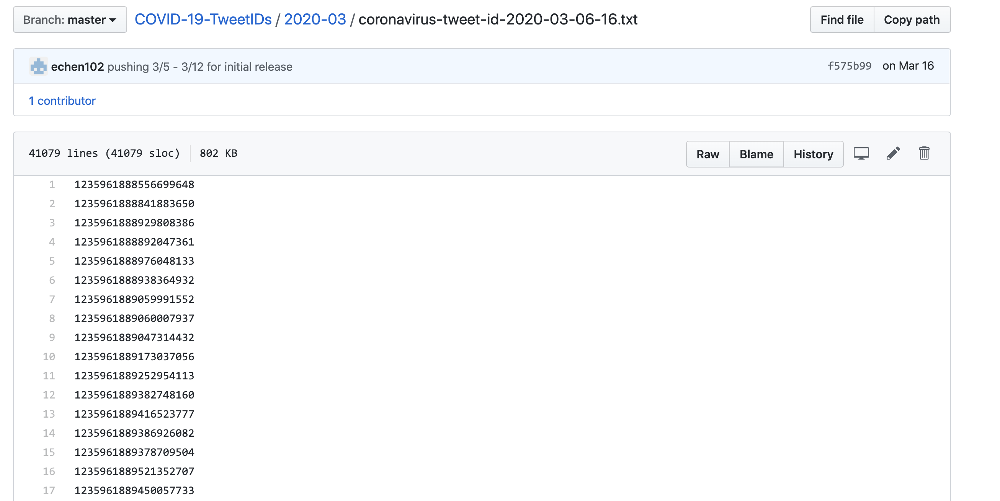
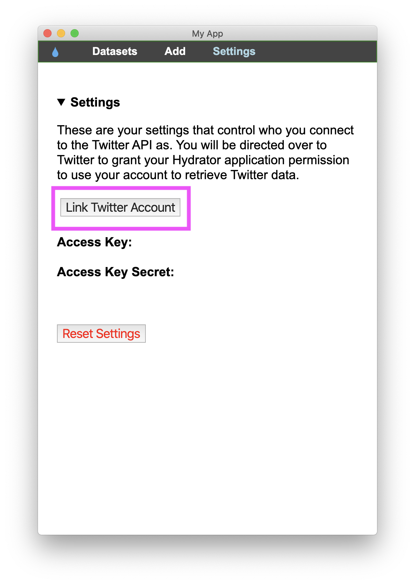
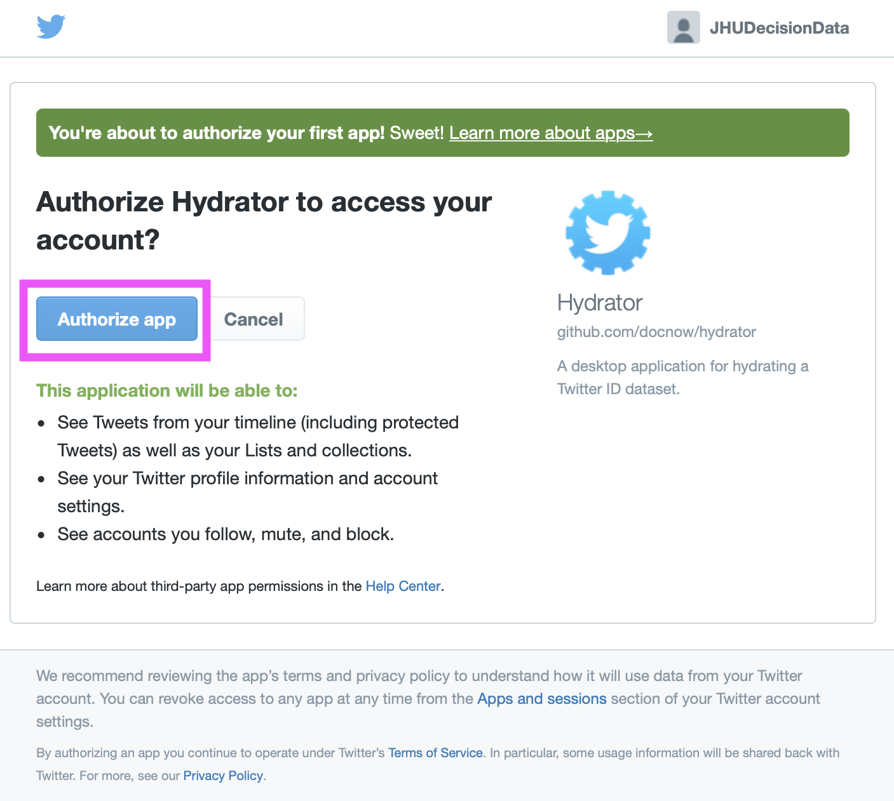
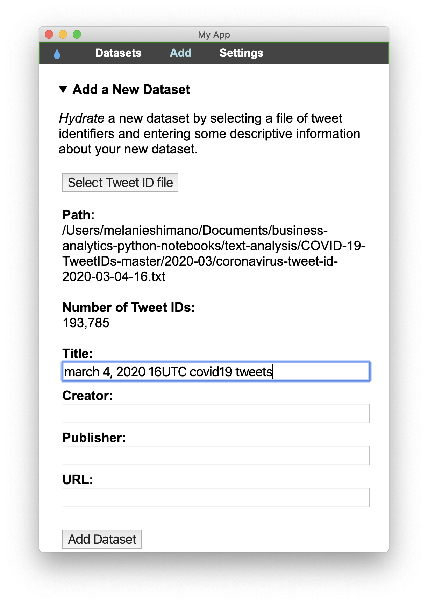
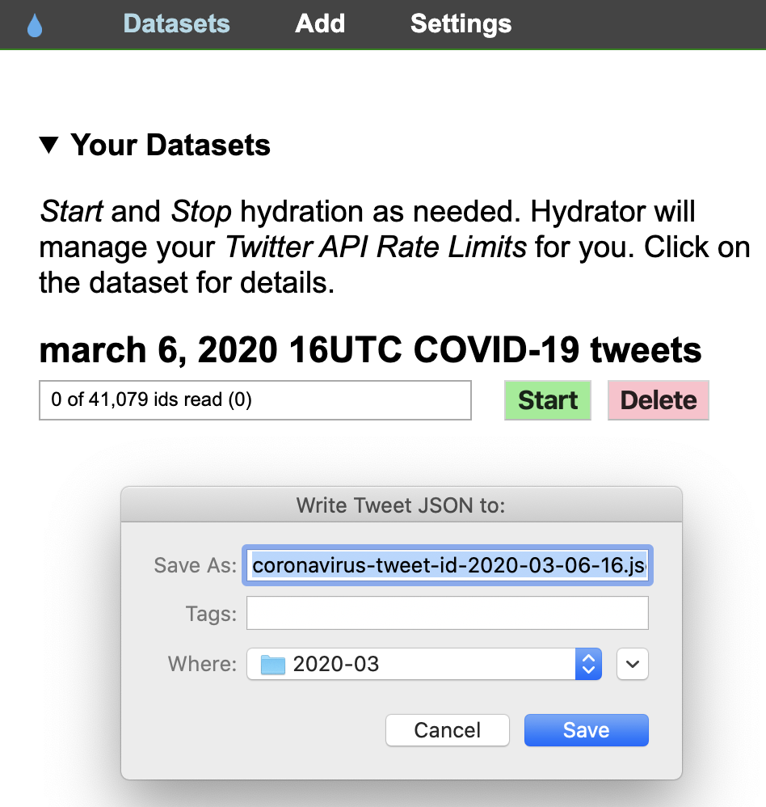
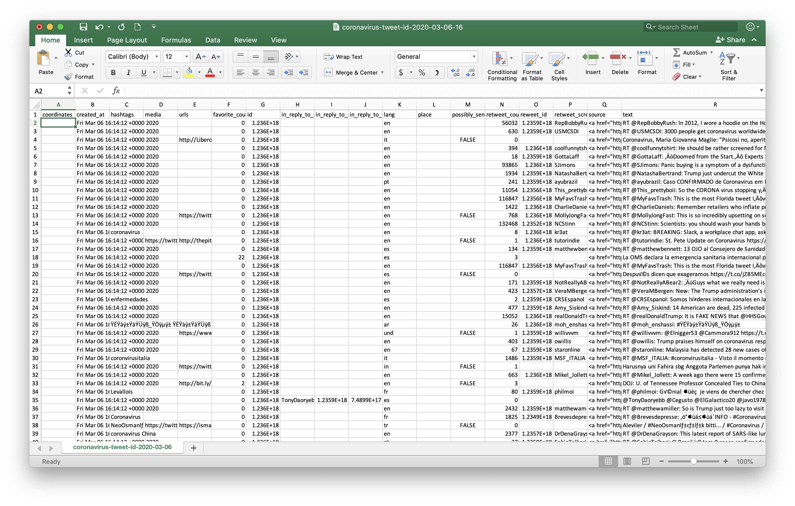

# Rehydrating Tweet IDs for Data Analysis

Although we have [COVID-19-related Twitter data](https://github.com/echen102/COVID-19-TweetIDs) from January 21, 2020-today, because of the Twitter Developer sharing restrictions, this data is formatted as only Tweet IDs, which [looks like:](https://github.com/echen102/COVID-19-TweetIDs/blob/master/2020-03/coronavirus-tweet-id-2020-03-06-16.txt)

This isn't really useful for us in it's current form except for counting the number of Tweets in a given period of time because this doesn't have any specific information about the Twitter user, the Tweet text, the level of engagement, or any other information related to the Tweet. 

Although Twitter restricts the format of distributed Tweet, Message, and User data, they allow end users to "rehydrate" the Tweet IDs, which restores the original tweet information and associated data as long as the Tweet, Message, or User has not deleted this information. We can rehydrate the Tweet IDs with Python packages such as [`twarc`](https://guides.temple.edu/c.php?g=123755&p=6097990), or through a user interface called [Hydrator](https://github.com/DocNow/hydrator). We'll use the Hydrator application to rehydrate a two hours of Tweets, since hydrating the entire data set will take over 24 hours. 

### Using Peak Twitter Activity Data

Because there are so many COVID-19-related Tweets in the dataset, the Tweet ID data is organized to help us best access the information that we may need in subsets which won't take too long to rehydrate. Each file in the data is [named](https://github.com/echen102/COVID-19-TweetIDs#data-organization) with the convention: **`“coronavirus-tweet-id-” followed by the YEAR-MONTH-DATE-HOUR`**, where each hour is reported in UTC \([four hours after EDT](https://savvytime.com/converter/edt-to-utc)\). Since we want to analyze Tweets that may correspond with changes in the spread of COVID-19 in the US, we're primarily concerned with analyzing peak Twitter activity in the US. According to [SproutSocial](https://sproutsocial.com/insights/best-times-to-post-on-social-media/#tw-times), peak Twitter activity occurs on Wednesdays and Fridays from 9-10 AM. Since our Twitter data only reports time in UTC, and since there is relatively high activity from 9 AM-12 PM, we'll estimate that the Twitter data from the hour starting at 16:00 UTC \(9:00 AM PDT and 12:00 PM EDT\) on Wednesday, March 4, 2020 and Wednesday, April 1, 2020, will give us a large amount of Twitter activity to analyze in a relatively standard timeframe. 

### Downloading Tweet ID Data

We'll first download the Tweet ID data that we want to hydrate. You can either do this by downloading the entire [GitHub repository file](https://www.dropbox.com/s/d5qtnxed3unvf0g/Screenshot%202020-04-25%2009.08.36.png?dl=0):

1. Click on the green Clone or download button
2. Click on Download ZIP
3. Double-click the zipped file to extract all of the files in the GitHub repository
4. Locate the Tweet ID file for March 6, 2020 at 16:00 UTC \(**`coronavirus-tweet-id-2020-03-04-16.txt`**\) in the **`2020-03`** folder
5. Locate the Tweet ID file for April 10, 2020 at 16:00 UTC \(**`coronavirus-tweet-id-2020-04-01-16.txt`**\) in the **`2020-04`** folder

Or, downloading the text files directly from the GitHub repository:

1. Tweet ID file for [March 4, 2020 at 16:00 UTC](https://github.com/echen102/COVID-19-TweetIDs/blob/master/2020-03/coronavirus-tweet-id-2020-03-04-16.txt) \(**`coronavirus-tweet-id-2020-03-04-16.txt`**\) in the **`2020-03`** folder
2. Tweet ID file for [April 1, 2020 at 16:00 UTC](https://github.com/echen102/COVID-19-TweetIDs/blob/master/2020-04/coronavirus-tweet-id-2020-04-01-16.txt) \(**`coronavirus-tweet-id-2020-04-01-16.txt`**\) in the **`2020-04`** folder

by clicking on the **Raw** button to access the raw data and saving this as a .txt file.

### Using Hydrator to Rehydrate Tweet IDs

Download the Hydrator app [here](https://github.com/DocNow/hydrator/releases) by clicking on the file that corresponds with your computer's operating system:

* .dmg file for MacOs
* .exe file for Windows
* .AppImage file for Linux
* .deb for Linux Debian distribution

Double click the downloaded file to [install](https://github.com/DocNow/hydrator#install) this in your Applications folder, and open the Hydrator application.

> **Note for OS X Users from the Hydrator documentation:**
>
> Since the Hydrator has not been [signed](https://developer.apple.com/developer-id/) \(which requires us to pay Apple in order to register as a developer\) your initial start up of the Hydrator will be prevented. You can convince OS X to open it anyway by locating the Hydrator app in your _Applications_ folder, control-clicking on it, selecting and then clicking _Open_ \(see the screenshot below\). From this point on your Hydrator should start normally.

 When you first open Hydrator, you'll need to link your Twitter account information so that Hydrator can use your API keys to rehydrate the tweets for you. For this to work, you'll need to [create a Twitter account](https://twitter.com/i/flow/signup) \(if you don't have one already\).

Click the Link Twitter Account button in Hydrator:

which will redirect you to the Twitter website. Log into your Twitter account here and then Authorize Hydrator to access your account:

and enter the Access PIN in the Hydrator application to complete the setup process. This allows Hydrator to use your Twitter account API keys to rehydrate the tweets without you needing to run any code. 

Upload the March 4, 2020 16:00 UTC Tweet ID text file in Hydrator, and enter a title for this file upload. We can see that this particular file contains 193,785 tweets:

After you click Add Dataset, click on **Start** button on the next page to start rehydrating the Tweet IDs. This will require you to initialize a .json file \(click Save when prompted\):

This will begin the process for hydrating the Tweet IDs into full Tweet data, which should take less than 15 minutes for this data set. 

After the file has been hydrated, click on the **CSV** button to download and save a CSV of the hydrated tweets in the file where you'll conduct your data analysis in JupyterLab that looks like this: 

Repeat this hydrating process for the April 1, 2020, 16:00 UTC text file. Notice that this dataset only contains 55,458 tweets.

Now we have two datasets to use for our text analysis.

